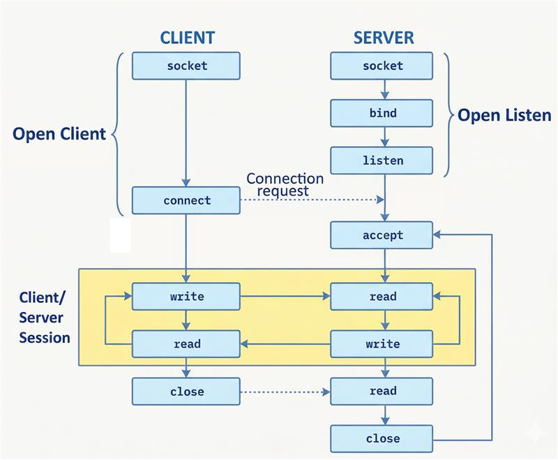

# Socket Theory - TCP/IP Programming

## Cos'è un Socket?

Un **SOCKET** è un'**astrazione software** che rappresenta un **punto terminale** di una comunicazione bidirezionale tra due processi (anche su macchine diverse).

**Analogia**: Pensa al socket come a una "presa telefonica" che permette a due programmi di parlare tra loro attraverso la rete.

---

## Schema Primitive Socket API




## Modello ISO/OSI (7 Livelli)

Le socket operano tra il **livello TRASPORTO** (Layer 4) e **APPLICAZIONE** (Layer 7):

| Livello | Nome          | Descrizione                          |  |
|---------|---------------|--------------------------------------|--------|
| **7**   | APPLICAZIONE  | DNS,HTTP, FTP, SMTP,...                      |        |
| **6**   | PRESENTAZIONE | Crittografia, compressione           |        |
| **5**   | SESSIONE      | Gestione connessioni                 |        |
| **4**   | **TRASPORTO**     | **TCP/UDP (affidabilità)**               | ← `SOCKET_TYPE` |
| **3**   | RETE          | IP (indirizzamento)                  | ← `ADDRESS_FAMILY` |
| **2**   | COLLEGAMENTO  | Ethernet, Wi-Fi                      |        |
| **1**   | FISICO        | Cavi, onde radio                     |        |

---

## Flusso di Comunicazione

### SERVER (Passivo - Ascolta)
### Da istanziare per primo, aspetta connessioni in arrivo

#### **OPEN LISTEN** (Preparazione)
1. **`socket()`** - Crea la socket
2. **`bind(IP, porta)`** - Associa al processo un indirizzo IP e una porta alla socket
3. **`listen(backlog)`** - Mette in ascolto (crea coda connessioni)

#### **CONNECTION REQUEST** (Accettazione)
4. **`accept()`** - Accetta connessione (**bloccante**)
   - Ritorna una **NUOVA socket** dedicata al client
   - Il *three-way handshake* è completato:
     - Client → Server: `SYN` (voglio connettermi)
     - Server → Client: `SYN-ACK` (accetto)
     - Client → Server: `ACK` (connessione stabilita)

#### **CLIENT/SERVER SESSION** (Comunicazione)
5. **`recv(buffer_size)`** - Riceve dati dal client (**bloccante**)
6. **`send(data)`** o **`sendall(data)`** - Invia risposta

#### **CHIUSURA SOCKET SERVER** (Chiusura Server se necessario)
7. **`close()`** - Chiude socket server

---

### CLIENT (Attivo - Inizia la comunicazione)
#### Da istanziare dopo il server, si connette a esso

#### **OPEN CLIENT** (Creazione)
1. **`socket()`** - Crea la socket

#### **CONNECTION REQUEST** (Connessione)
2. **`connect(IP, porta)`** - Si connette al server (**bloccante**)
   - Inizia il *three-way handshake*
   - Il sistema operativo assegna automaticamente una **porta effimera** (49152-65535) al client

#### **CLIENT/SERVER SESSION** (Comunicazione)
3. **`send(data)`** - Invia dati al server
4. **`recv(buffer_size)`** - Riceve risposta (**bloccante**)

#### **CHIUSURA SOCKET CLIENT** (Chiusura Client se necessario)
5. **`close()`** - Chiude la connessione
   - *Four-way handshake (oppure, double Two-way handshake)*:
     - Client → Server: `FIN` (ho finito)
     - Server → Client: `ACK` (ricevuto)
     - Server → Client: `FIN` (anche io)
     - Client → Server: `ACK` (chiuso)

---

## Concetti Importanti


### Codifica/Decodifica
Le socket lavorano con **bytes**, non stringhe!

- **Stringa → Bytes**: `messaggio.encode('utf-8')`
- **Bytes → Stringa**: `data.decode('utf-8')`

---

### TCP è un protocollo a FLUSSO (stream), non a MESSAGGIO!
Non c'è garanzia che `recv()` riceva esattamente ciò che `send()` ha inviato in una singola chiamata.

**Esempio**: Se il client invia 3 messaggi: `"Ciao"`, `"Come"`, `"Stai?"`

Il server potrebbe ricevere:
- `"CiaoComeStai?"` in una sola `recv()` (concatenati)
- `"Ciao"` + `"Come"` + `"Stai?"` in tre `recv()` separate
- `"CiaoCo"` + `"meStai?"` in due `recv()` frammentate

**Soluzione**: In applicazioni reali serve un **protocollo applicativo**:
- Delimitatori (es. `\n`)
- Lunghezza fissa dei messaggi
- Header con dimensione (es. `[4 bytes lunghezza][dati]`)

### Differenza tra `send()` e `sendall()`

- **`send(data)`**: Invia **parte** dei dati, restituisce quanti bytes sono stati inviati. Potrebbe richiedere più chiamate!
- **`sendall(data)`**: Chiama `send()` ripetutamente finché **TUTTI** i dati sono inviati. **Raccomandato per TCP!**

### Buffer e Chiamate Bloccanti

- **`accept()`**: Blocca finché non arriva una connessione
- **`recv()`**: Blocca finché non arrivano dati (o la connessione si chiude)
- **`connect()`**: Blocca finché non si stabilisce la connessione
- **`send()`/`sendall()`**: Può bloccare se il buffer di invio è pieno

I dati vengono temporaneamente memorizzati nei **buffer del kernel** prima di essere inviati/ricevuti sulla rete.

## Esecuzione

### Avviare prima il Server (in ascolto)
```bash
python server.py
```

### Avviare il Client (in un altro terminale)
```bash
python client.py
```

---